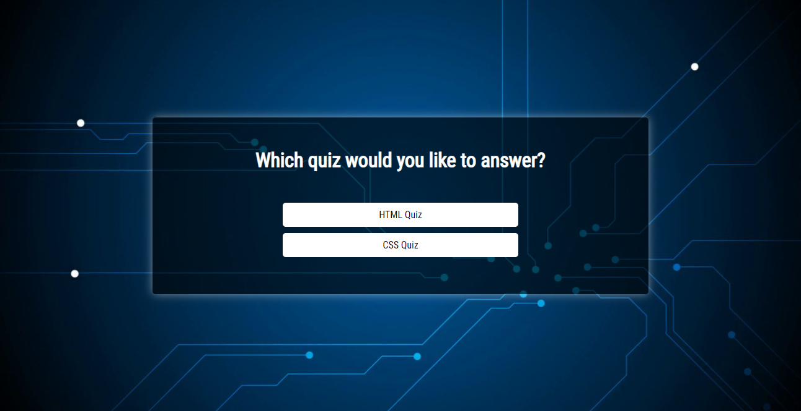
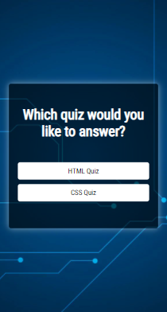

# Front-end Quiz Appliaction

This is a quiz application for front-end technologies (HTML and CSS).

Users should be able to:

- Go HTML or CSS quiz pages with Homepage buttons
- Answer 10 questions in the HTML or CSS quiz pages
- See the final score at the end of the quiz
- View the optimal layout for the component depending on their device's screen size

## Screenshot

Desktop design of Homepage:

Mobile design of Homepage:

## Links

- [Live Site URL](https://frontend-quiz.vercel.app/)

## Built with

- Semantic HTML5 markup
- CSS custom properties
- Flexbox
- JavaScript
- Responsive Design

## Author

- Website - [Sheyda Sultanova](https://sheydasultanova.vercel.app/)
- LinkedIn- [Sheyda Sultanova](https://www.linkedin.com/in/sheyda-sultanova/)